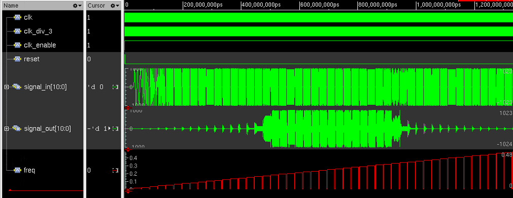

# Project description
This repository is dedicated to building digital filter from mathematical model in **_MatLab Simulink_** to RTL and then to ASIC (IP-core) topology with **_Cadence_** tools such as **_RTL-Compiler_**, **_Encounter_** and **_Viruoso_** for final sign-off verification.
The filter is a passband IIR-filter with x3 parallelization for higher operating sample frequency.

Filter characteristics are as follows (_f~s~_ - sample frequency):
<table>
    <tr>
        <td></td>
        <td>Frequency, <i>fs</i></td>
        <td></td>
        <td>Attenuation, dB</td>
    </tr>
    <tr>
        <td>Passband center</td>
        <td>0.15</td>
        <td>Stopband attenuation</td>
        <td>65</td>
    </tr>
    <tr>
        <td>Passband center</td>
        <td>0.25</td>
        <td>Passband ripple</td>
        <td>0.25</td>
    </tr>
    <tr>
        <td>Transition bands</td>
        <td>0.05</td>
    </tr>
</table>

Input/Output bit depth = 11 bits.

Synthesis constraints:
Target sample frequency = 20 MHz, clock uncertanty (jitter) = 10%.

Filter's coefficients are calculated with **_MatLab's Filter Designer_** utility (fdatool).  
The resulting filter is 12-th order elliptic filter.  
Input samples are in fixed point representation so as arithmetics inside filter.  
Every arithmetic block's output bit depth was minimized to to such an extent that the output of fixed point filter model had a maximum error from refence model of no more then 0.5 LSBs.    

# Project Results
Filter's HDL-description is written in SystemVerilog, top-level architecture of this DSP-block is shown below.

(_fs_ and _fs/3_ denotes sample rates at different stages of a design.)

Testing filter with chirp-like input signal results in desired frequency response.

Here is an image of a layout from Encounter with rulers.

Resulting filter has been synthesized, dimensions are 1290 $`\mu`$m by 890 $`\mu`$m, and total area is 1.1 $mm^{2}$. Final сore utilization is around 60-70%.  

# This directory contains two subdirectories:
* **_/RTL_**,
* **_/Simulink_**.

## _/RTL_
First one contains everything related to rtl: final version of filter rtl-description, everything related to design synthesis (logical and physical).

## _/Simulink_
Second subdirectory contains Simulink model files, result of HDL conversion by HDL Coder and a script for reference data generation for RTL-simulation.

Go to dedicated README's to find files descriptions and instructions on how to build project. 
